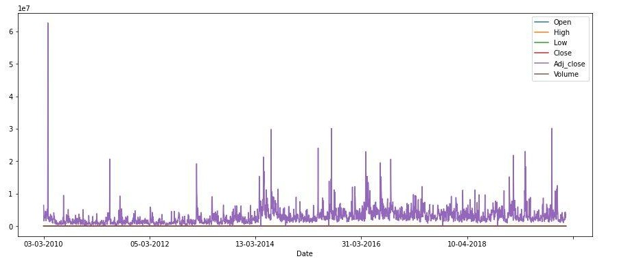
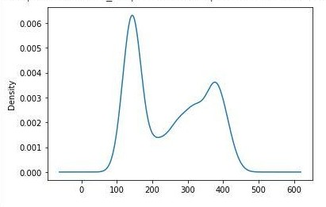

# Stock-Market-Predictor

This contains our project for the course Data Mining, titled Stock Market Predictor. The project applies various Models (such as ARIMA, SVM, various ensemble approaches) in a Dataset of Stock Market for 5 Years , plus Technical Indicators, Wikipidea hits, News mentions and other such features.

## Introduction

This project deals with the time series analysis of the stock market and then using it to predict
future trends.
Stock Market:- A stock or share is a financial instrument that represents the percentage of
ownership in a company or corporation and represents a proportionate claim on its assets and
earnings (what it generates in profits).

Every stock exchange can be represented by a Stock Index value, which is an average value
calculated by combining several stocks. This value helps in representing the entire stock market
and predicting the change in the market’s movement over time.
Early researches used machine learning to create models using the time series data which can
predict or forecast sequences or outcomes. But this approach turned out to be very ​ difficult
because of the complex features involved in this prediction.

## Dataset used-
Yahoo Stock (from March 2010 to March 2020) has been collected to be used in training.
The companies used are part of the Nifty50 group of companies ​ as of 17 November 2019​ .The dataset collected consists of 8 features (date, open, high, low, close, volume, adj close,
comp). To this dataset we added features like Technical Indicators, number of wiki hits, news mentions for each company, each day.

## Trends-
Fig1: Shows the closing price trend of Adani Ports for over 10 years-

Fig2: This is a KDE plot of the closing price of Adani Ports over 10 years-

We see that the data is not Gaussian (normally distributed).
Similarly, we need to analyze the trend of the company to which we fit our model and make
appropriate transformations to the data prior to modeling and then run the model on it.

## Techniques and Methodology:

### Features:
We include some technical indicators such as RSI, MA(moving average), MACD, etc.
The number of Wiki mentions and google news mentions will be used as indicators for every
company in the Nifty50 group. Also, the same is done for the related products of each company.
The relation between the company and its products is determined by the Google knowledge
graph which is then adjusted based on its result score.

### Models
● SVR:-
Support Vector Regression works on the principle of Support Vector Machine. It allows
the prediction of a non-linear model without changing any explanatory variables, based
on the functions of the kernel like linear, sigmoid, polynomial, radial basis, etc, rather
than the distributions of the dependent and independent variables underlying it.
In SVR we try to fit the error in a threshold.

● SARIMA:-
Seasonal Autoregressive Integrated Moving Average (SARIMA) model is an expansion
of the ARIMA model. SARIMA is used to forecast a time series on the basis of some
past values. It also supports the seasonal data which is not a part of the ARIMA model. It
includes three hyperparameters- autoregression, differencing and moving average to
add the seasonality feature in the model.

